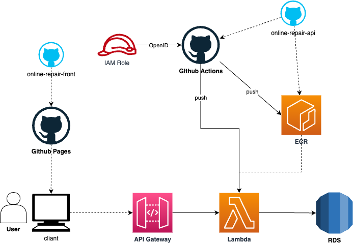

# アプリケーション概要（開発中）
靴の修理をオンラインで受付けられるサービスのモックアプリです。  
現在はバックエンド部分の開発中です。  
- [APIリポジトリ](https://github.com/shogo02/online-repair-api "online-repair-api")

# 機能一覧（予定）
- アカウントの登録、変更、削除
- 修理の申し込み、キャンセル
- ユーザー、オーナーからの発送通知
- 修理進行状況の閲覧、管理
- オンライン決済
- ユーザーとオーナー間のチャット
- ユーザーからの問い合わせ

# 使用技術
- React(TypeScript)
  - react-spring：アニメーション用のライブラリ
  - react-stars-rating：星表示用のライブラリ
- Github Pages
  - Github Cliを用いて、デプロイ
- FastAPI(Python)
- Github Actions
- AWS
  - ECR
  - Lambda(コンテナイメージ)
  - API Gateway
  - RDS

# やることリスト
- 環境構築
  - [x] ECR構築、lambdaへのデプロイ自動化
  - [x] Lambda構築
  - [x] API Gateway構築、外部からAPI実行、Lambdaへの疎通確認
  - [ ] フロントエンドからのAPI疎通確認
  - [ ] RDS構築、Lambdaからの疎通確認
- API実装
  - [x] 疎通確認用のAPI実装
  - [ ] ハンドラー実装
  - [ ] 各機能のAPI実装
- フロント実装
  - [ ] ホーム画面実装
  - [ ] アカウント作成、ログイン機能実装
  - [ ] 各機能の画面実装
